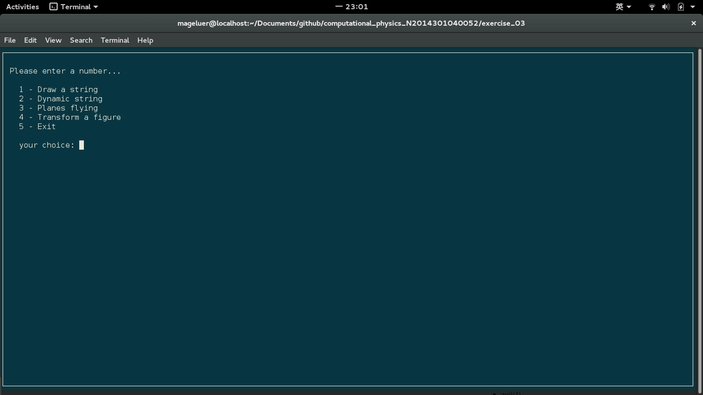
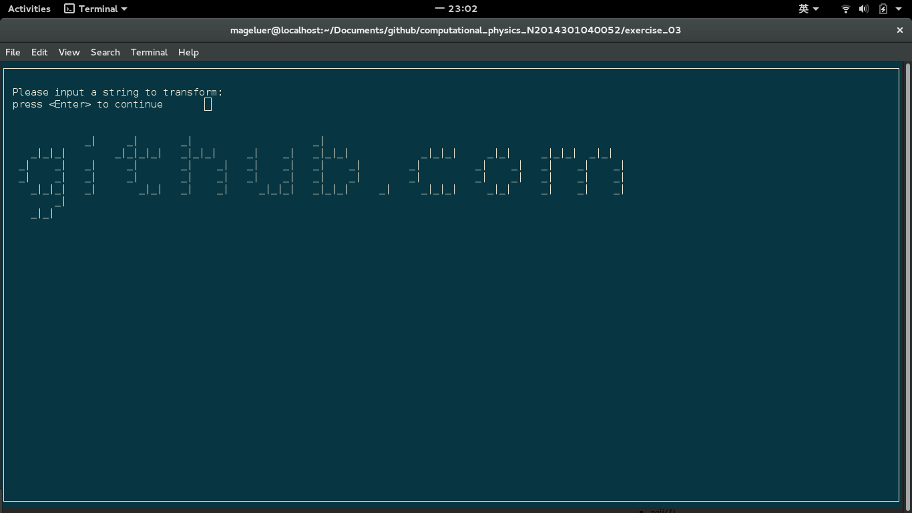
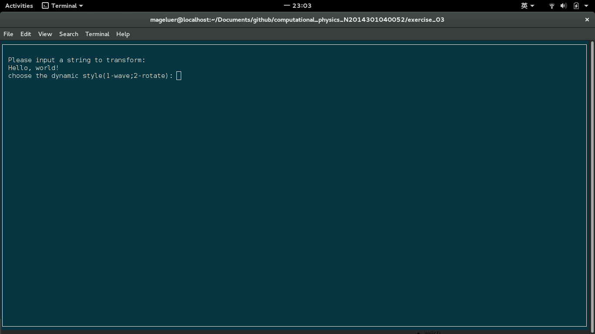
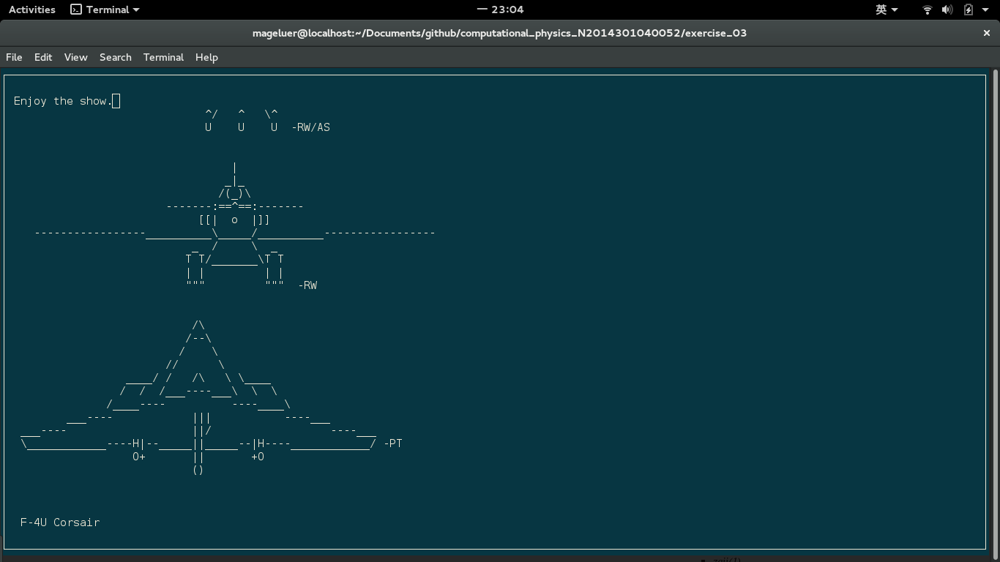
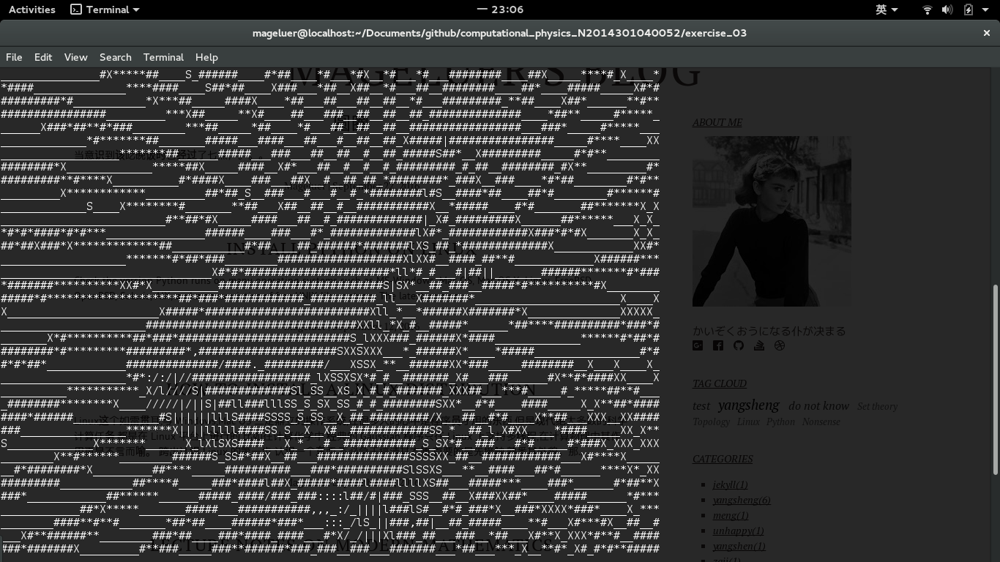

# A Trial on ASCII Art

## Abstract
Using ASCII to create images or even cartoons is pretty cool! In this program, the curses library is applied to display well ognized ASCII chars and all the codes are wrote in an obfect-oriented manner, which does a great help to program design. String to text and figure to text are all realized as well as some dynamic effects.

## Background
### ASCII
ASCII, abbreviated from American Standard Code for Information Interchange, is a character encoding standard (the Internet Assigned Numbers Authority (IANA) prefers the name US-ASCII). ASCII codes represent text in computers, telecommunications equipment, and other devices. Most modern character-encoding schemes are based on ASCII, although they support many additional characters.
### ASCII Art
ASCII art is a graphic design technique that uses computers for presentation and consists of pictures pieced together from the 95 printable (from a total of 128) characters defined by the ASCII Standard from 1963 and ASCII compliant character sets with proprietary extended characters (beyond the 128 characters of standard 7-bit ASCII). The term is also loosely used to refer to text based visual art in general. ASCII art can be created with any text editor, and is often used with free-form languages. Most examples of ASCII art require a fixed-width font (non-proportional fonts, as on a traditional typewriter) such as Courier for presentation.
### Curses Library
The curses library supplies a terminal-independent screen-painting and keyboard-handling facility for text-based terminals; such terminals include VT100s, the Linux console, and the simulated terminal provided by various programs. Display terminals support various control codes to perform common operations such as moving the cursor, scrolling the screen, and erasing areas. Different terminals use widely differing codes, and often have their own minor quirks.

## Results
### Menu
A menu is more friendly for users even though this program is doomed to have no user. ):   
**The best advice is to maximize your window.**

### Draw String
Any char can be displayed in ASCII text as long as you can type it out. The default input is "Mageluer" if you type nothing.   
**But a very long string is not encouraged and I set the limit to 60 chars.**

### Dynamic String
I realize two dynamic effects(wave and rotation).   
   
An example of wave effect:   
  
**Again, the length of string should be reasonable.**
### Planes Flying
All kinds of planes flying from the bottom to the upper. Just enjoy the show.   

### Picture to Ascii
Now, we can transform a figure in to ASCII texts. Sounds exciting?   
This unluky whale is transformed into ASCII codes.   

## Discussion
### Save File
Maybe I will active this function some days later so that the fantastic ASCII works can be saved or shared. Is it meaningful?
### Video Transform
It is really cool that we can play a video in ASCII cartoons.   
Contemporary web browser revitalized animated ASCII art again. It became possible to display animated ASCII art via JavaScript or Java applets. Static ASCII art pictures are loaded and displayed one after another, creating the animation, very similar to how movie projectors unreel film reel and project the individual pictures on the big screen at movie theaters. A new term was born: ASCIImation – another name of Animated ASCII Art. A seminal work in this arena is the Star Wars ASCIImation.   
A long way to go.
### Ascii Figure Generator
While some prefer to use a simple text editor to produce ASCII art, specialized programs, such as JavE have been developed that often simulate the features and tools in bitmap image editors. If you really like ASCII art, it is a good idea to create your own generator.

## Acknowlegement
### Reference
1. Curses Programming with Python--Python 3.5.2 documentation, <https://docs.python.org/3/howto/curses.html>
2. Curses Programming with Python--Python 2.7.12 documentation, <https://docs.python.org/2/howto/curses.html>
3. curses — Terminal handling for character-cell displays, <https://docs.python.org/2/library/curses.html>
4. Code Project: Build an Ncurses UI with Python, <http://www.tuxradar.com/content/code-project-build-ncurses-ui-python>
5. 可爱的 Python：Curses 编程, <https://www.ibm.com/developerworks/cn/linux/sdk/python/python-6/>
6. ASCII art for tag plane, <http://textart.io/art/tag/plane>
7. ASCII ART - TRANSPORTATION, <http://www.won.nl/dsp/usr/mvketel/internet/Asciiart/tprtmain.html>
8. NASA - Space program - Lunar lander - Rocket - Rockets - Spaceship - Spaceships - Apollo, <http://www.chris.com/ascii/index.php?art=transportation/space%20ships>
9. Text to ASCII Art Generator, <http://patorjk.com/software/taag/#p=display&h=2&v=3&f=Chiseled&t=Type%20Something%20> 
