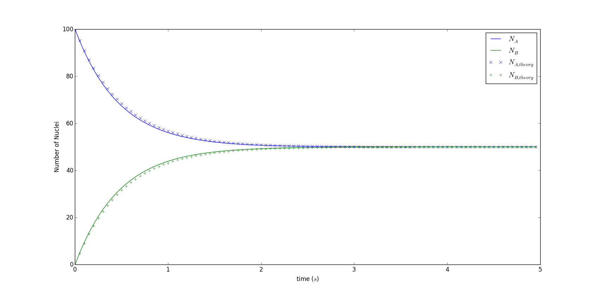

# Solutions to A Nuclei Decay Problem with Eluer Method

## Abstract
Euler method is a useful general algorithm for solving ordinary differential equations. Here we apply this method to abtain a numerical solution to the radioactive decay problem.

## Background
### Eluer Method
In mathematics and computational science, the Euler method is a first-order numerical procedure for solving ordinary differential equations (ODEs) with a given initial value. It is the most basic explicit method for numerical integration of ordinary differential equations and is the simplest Runge–Kutta method. The Euler method is named after Leonhard Euler, who treated it in his book Institutionum calculi integralis (published 1768–70).

The Euler method is a first-order method, which means that the local error (error per step) is proportional to the square of the step size, and the global error (error at a given time) is proportional to the step size. The Euler method often serves as the basis to construct more complex methods, e.g., Predictor–corrector method.

### Problem Description
Consider again a decay problem with two types of nuclei A and B, but now suppose that nuclei of type A decay into ones of type B, while nuclei of type B decay into type A. Strictly speaking, this is not a "decay" process, since it is possible for the type B nuclei to turn back into type A nuclei. A better analogy would be a resonance in which a system can tunnel or move back and forth between two states A and B which have equal energies. The corresponding rate equations are

where for simplicity we have assumed that the two types of decay are characterized by the same time constant,  Solve this system of equations for the numbers of nuclei,  and , as functions of time. Consider different initial conditions, such as   etc., and take  s. Show that your numerical results are consistent with the idea that the system reaches a stteady state in which  and  are constant. In such a steady state, the time derivatives  and  should vanish.

## Main
### Problem Analysis
It is easy to see 

.

Thus, we get  and  by apply  where  is the sum of nuclei number. Then, we get

and the solution is around the corner.

### Theoretical Solution
Solve the simple ordinary equations we can get analytic solutions

   

which provides a good comparison to numerical solutions.

## Results
;; 

We can try different values of . Obviously the smaller  is and the more precise the result will be.

## Discussion
There is no doubt that we preffer a analytic solution to a numerical solution. Why not try it?

## Acknowledgement
Thanks to **_John Hunter_**!  
If you have benefited from John's many contributions, please say thanks in the way that would matter most to him. Please consider making a donation to the <a href="http://numfocus.org/johnhunter/">John Hunter Technology Fellowship</a>
