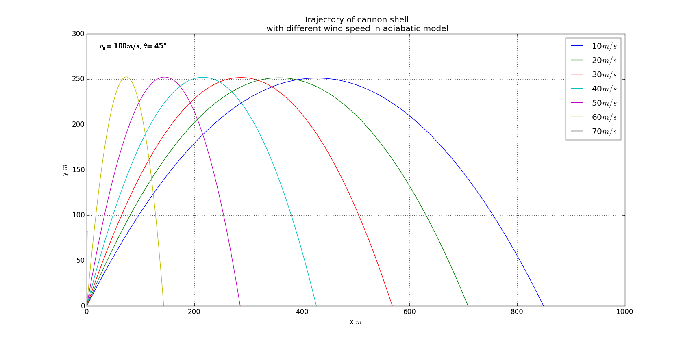
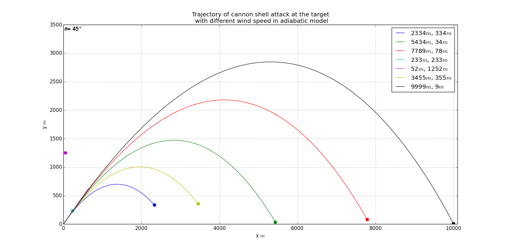
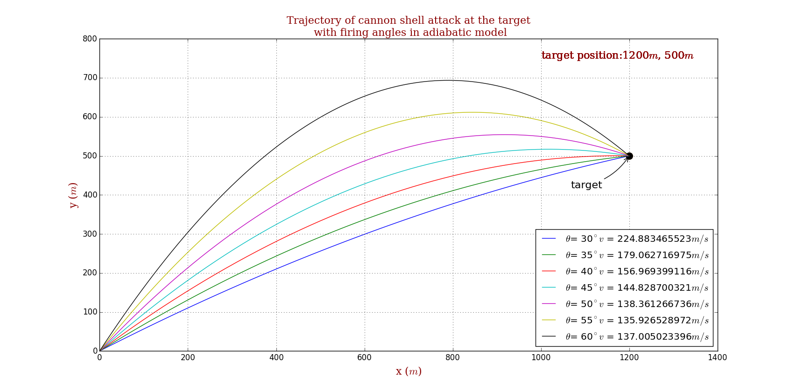
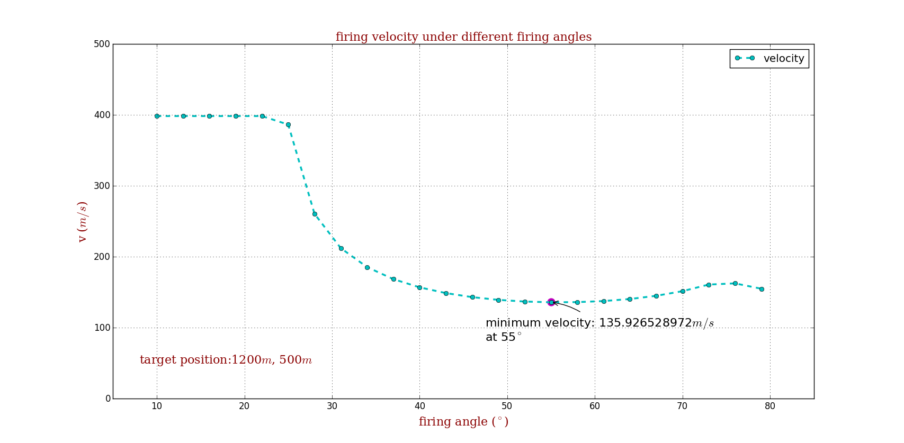

# Precision Strike Cannon

## Abstract
With **Midpoint method** and **bisection method**, it is easy to achieve a better solution to the cannon strike problem. However **algorithm complexity analysis** and **time complicity analysis** are very necessary to improve efficiency.

## Background

### Midpoint method
In numerical analysis, a branch of applied mathematics, the midpoint method is a one-step method for numerically solving the differential equation,

The explicit midpoint method is given by the formula

the implicit midpoint method by

The name of the method comes from the fact that in the formula above the function  giving the slope of the solution is evaluated at , which is the midpoint between  at which the value of y(t) needs to be found.

The local error at each step of the midpoint method is of order  , giving a global error of order . Thus, while more computationally intensive than Euler's method, the midpoint method's error generally decreases faster as .

### Bisection method
The bisection method in mathematics is a root-finding method that repeatedly bisects an interval and then selects a subinterval in which a root must lie for further processing. It is a very simple and robust method, but it is also relatively slow. Because of this, it is often used to obtain a rough approximation to a solution which is then used as a starting point for more rapidly converging methods. The method is also called the interval halving method, the binary search method, or the dichotomy method.

The method is applicable for numerically solving the equation f(x) = 0 for the real variable x, where f is a continuous function defined on an interval [a, b] and where f(a) and f(b) have opposite signs. In this case a and b are said to bracket a root since, by the intermediate value theorem, the continuous function f must have at least one root in the interval (a, b).

### Time complexity
In computer science, the time complexity of an algorithm quantifies the amount of time taken by an algorithm to run as a function of the length of the string representing the input:226. The time complexity of an algorithm is commonly expressed using big O notation, which excludes coefficients and lower order terms. When expressed this way, the time complexity is said to be described asymptotically, i.e., as the input size goes to infinity. For example, if the time required by an algorithm on all inputs of size n is at most 5n3 + 3n for any n (bigger than some n0), the asymptotic time complexity is O(n3).

Time complexity is commonly estimated by counting the number of elementary operations performed by the algorithm, where an elementary operation takes a fixed amount of time to perform. Thus the amount of time taken and the number of elementary operations performed by the algorithm differ by at most a constant factor.

Since an algorithm's performance time may vary with different inputs of the same size, one commonly uses the worst-case time complexity of an algorithm, denoted as T(n), which is defined as the maximum amount of time taken on any input of size n. Less common, and usually specified explicitly, is the measure of average-case complexity. Time complexities are classified by the nature of the function T(n). For instance, an algorithm with T(n) = O(n) is called a linear time algorithm, and an algorithm with T(n) = O(Mn) and Mn= O(T(n)) for some M ≥ n > 1 is said to be an exponential time algorithm.

## Problem Description
Here is the problem in the book.

> 2.10. Generalize the program developed for the previous problem so that it can deal with situations in which the target is at a different altitude than the cannon. Consider cases in which the target is higher and lower thatn the cannon. Also investgate how the minimum firing velocity required to hit the target varies as the altitude of the target is varied.

What's more, we should also find the velocity and the firing angle to strike the target precisely and search for the minimum velocity the hit the aim.

## Main
### Problem Analysis
Apart from finding velocity and angle, there is nothing else to add to the previous problem.  

Here I use the **Midpoint method** to get a more accurate solution and in fact it works as sopposed. I have introduced this method above but the difficulty is that there are more than two variables(read my code to get my idea).  
 
As for pinpoint strike and minimun speed, **bisection method** is not a bad choice. We must take efficiency into considerarion because  the models are not easy to maintain as they grow in size and complexity over many iterations.

I use the smallest tangent distance to determinate the falling point.

## Results
### Level 1: Add the wind drag
trojectories under different wind speed:

### Level 2: Strike the target
As you can see, each target is hit accurately(the precision up to 1e-8 m!) but it calculates quickly.

### Strike the target from different firing angles

### Firing velocity versus firing angle

## Discussion
There is no doubt that we prefer a analytic solution to a numerical solution. Why not try it?

## Acknowledgement
1. Thanks to **_John Hunter_**!  
If you have benefited from John's many contributions, please say thanks in the way that would matter most to him. Please consider making a donation to the <a href="http://numfocus.org/johnhunter/">John Hunter Technology Fellowship</a>
2. Thanks to **_Wikipedia_**! I copy too much from you.  
[This year, please consider making a donation of 50, 75, 100 yuan or whatever you can to protect and sustain Wikipedia.](https://donate.wikimedia.org/w/index.php?title=Special:FundraiserLandingPage&country=CN&uselang=en&utm_medium=sidebar&utm_source=donate&utm_campaign=C13_en.wikipedia.org)

