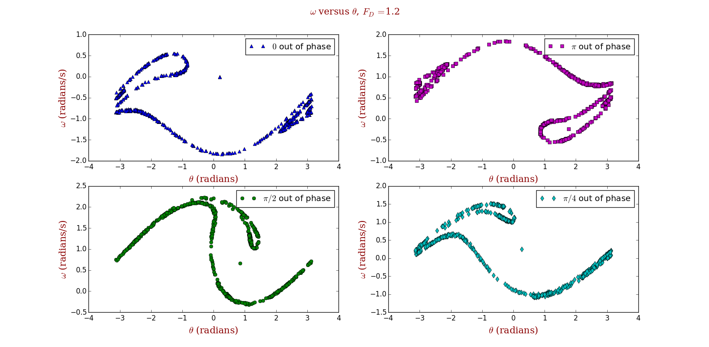
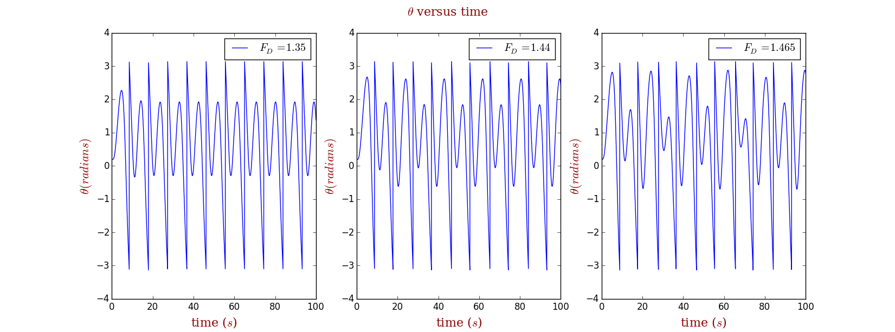
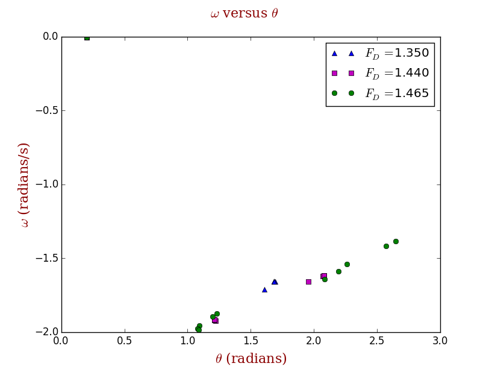
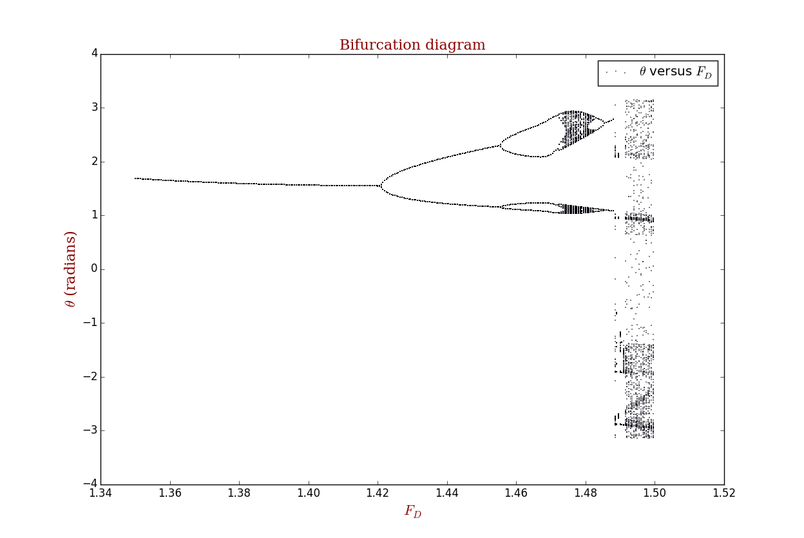
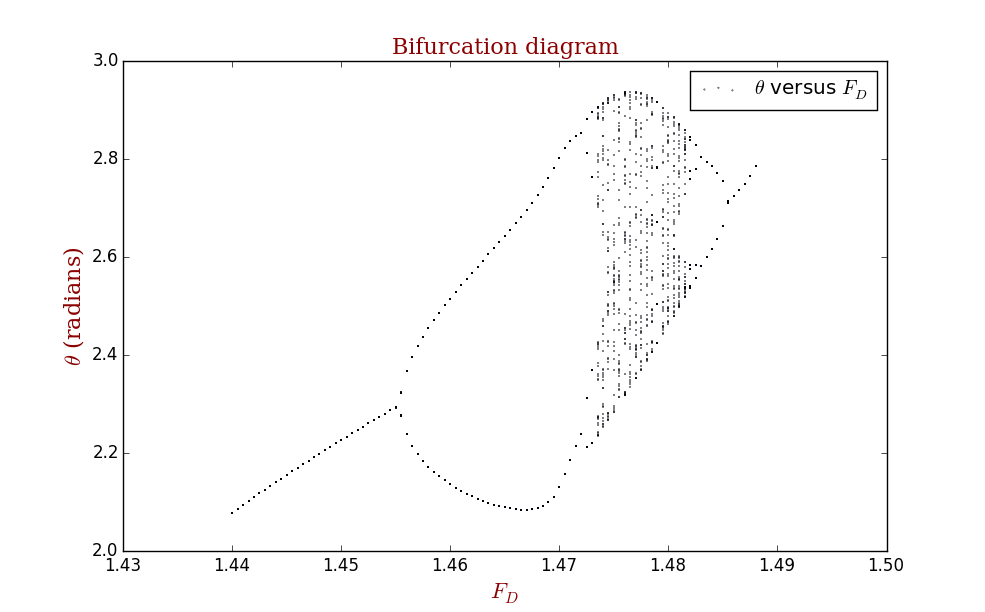
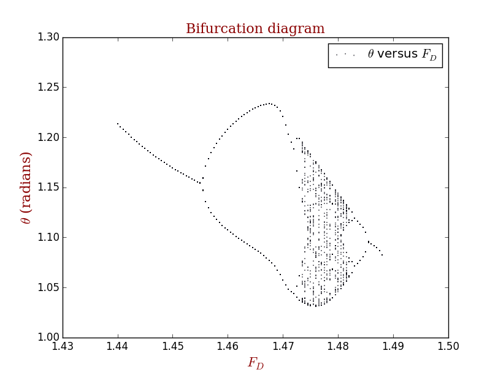
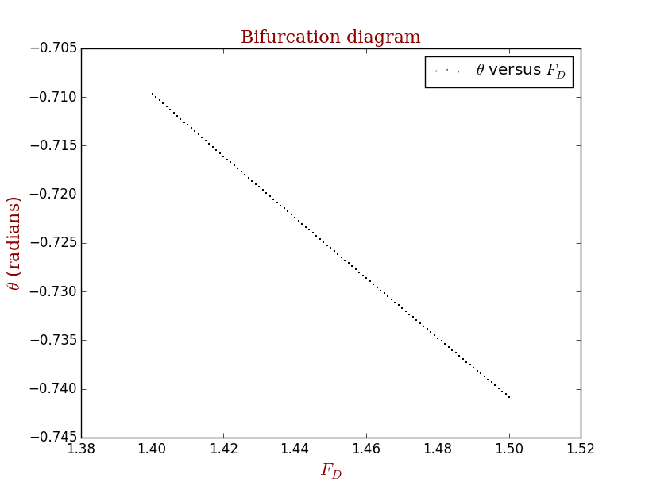

# Routes to Chaos: Period Doubling

## Abstract
With **Euler-Cromer Method**, it is easy to achieve a better solution to the driven nonlinear pendulum problem. And it is of great interest to study the **deterministic chaos**. In this exercise, I construct the Poincaré section and estimate the Lyapunov exponents.

## Background

### Euler-Cromer method
> From [Wikipedia](https://en.wikipedia.org/wiki/Semi-implicit_Euler_method), the free encyclopedia

In mathematics, the semi-implicit Euler method, also called symplectic Euler, semi-explicit Euler, Euler–Cromer, and Newton–Størmer–Verlet (NSV), is a modification of the Euler method for solving Hamilton's equations, a system of ordinary differential equations that arises in classical mechanics. It is a symplectic integrator and hence it yields better results than the standard Euler method.

#### Setting
The semi-implicit Euler method can be applied to a pair of differential equations of the form

where f and g are given functions. Here, x and v may be either scalars or vectors. The equations of motion in Hamiltonian mechanics take this form if the Hamiltonian is of the form

The differential equations are to be solved with the initial condition

#### The method
The semi-implicit Euler method produces an approximate discrete solution by iterating

where Δt is the time step and tn = t0 + nΔt is the time after n steps.

The difference with the standard Euler method is that the semi-implicit Euler method uses vn+1 in the equation for xn+1, while the Euler method uses vn.

Applying the method with negative time step to the computation of {\displaystyle (x_{n},v_{n})} (x_n,v_n) from {\displaystyle (x_{n+1},v_{n+1})} (x_{n+1},v_{n+1}) and rearranging leads to the second variant of the semi-implicit Euler method

which has similar properties.

The semi-implicit Euler is a first-order integrator, just as the standard Euler method. This means that it commits a global error of the order of Δt. However, the semi-implicit Euler method is a symplectic integrator, unlike the standard method. As a consequence, the semi-implicit Euler method almost conserves the energy (when the Hamiltonian is time-independent). Often, the energy increases steadily when the standard Euler method is applied, making it far less accurate.

### Chaos theory
> From [Wikipedia](https://en.wikipedia.org/wiki/Chaos_theory), the free encyclopedia

Chaos theory is the field of study in mathematics that studies the behavior of dynamical systems that are highly sensitive to initial conditions—a response popularly referred to as the butterfly effect. Small differences in initial conditions (such as those due to rounding errors in numerical computation) yield widely diverging outcomes for such dynamical systems, rendering long-term prediction impossible in general. This happens even though these systems are deterministic, meaning that their future behavior is fully determined by their initial conditions, with no random elements involved. In other words, the deterministic nature of these systems does not make them predictable. This behavior is known as deterministic chaos, or simply chaos. The theory was summarized by Edward Lorenz as:

> Chaos: When the present determines the future, but the approximate present does not approximately determine the future.

Chaotic behavior exists in many natural systems, such as weather and climate. It also occurs spontaneously in some systems with artificial components, such as road traffic. This behavior can be studied through analysis of a chaotic mathematical model, or through analytical techniques such as recurrence plots and Poincaré maps. Chaos theory has applications in several disciplines, including meteorology, sociology, physics, environmental science, computer science, engineering, economics, biology, ecology, and philosophy.

#### Strange attractors
Some dynamical systems, like the one-dimensional logistic map defined by x → 4 x (1 – x), are chaotic everywhere, but in many cases chaotic behavior is found only in a subset of phase space. The cases of most interest arise when the chaotic behavior takes place on an attractor, since then a large set of initial conditions leads to orbits that converge to this chaotic region.

An easy way to visualize a chaotic attractor is to start with a point in the basin of attraction of the attractor, and then simply plot its subsequent orbit. Because of the topological transitivity condition, this is likely to produce a picture of the entire final attractor, and indeed both orbits shown in the figure on the right give a picture of the general shape of the Lorenz attractor. This attractor results from a simple three-dimensional model of the Lorenz weather system. The Lorenz attractor is perhaps one of the best-known chaotic system diagrams, probably because it was not only one of the first, but it is also one of the most complex and as such gives rise to a very interesting pattern, that with a little imagination, looks like the wings of a butterfly.

Unlike fixed-point attractors and limit cycles, the attractors that arise from chaotic systems, known as strange attractors, have great detail and complexity. Strange attractors occur in both continuous dynamical systems (such as the Lorenz system) and in some discrete systems (such as the Hénon map). Other discrete dynamical systems have a repelling structure called a Julia set, which forms at the boundary between basins of attraction of fixed points. Julia sets can be thought of as strange repellers. Both strange attractors and Julia sets typically have a fractal structure, and the fractal dimension can be calculated for them.

#### Minimum complexity of a chaotic system
Discrete chaotic systems, such as the logistic map, can exhibit strange attractors whatever their dimensionality. In contrast, for continuous dynamical systems, the Poincaré–Bendixson theorem shows that a strange attractor can only arise in three or more dimensions. Finite-dimensional linear systems are never chaotic; for a dynamical system to display chaotic behavior, it must be either nonlinear or infinite-dimensional.

The Poincaré–Bendixson theorem states that a two-dimensional differential equation has very regular behavior. The Lorenz attractor discussed above is generated by a system of three differential equations such as:

#### Bifurcation theory
Bifurcation theory is the mathematical study of changes in the qualitative or topological structure of a given family, such as the integral curves of a family of vector fields, and the solutions of a family of differential equations. Most commonly applied to the mathematical study of dynamical systems, a bifurcation occurs when a small smooth change made to the parameter values (the bifurcation parameters) of a system causes a sudden 'qualitative' or topological change in its behaviour.[1] Bifurcations occur in both continuous systems (described by ODEs, DDEs or PDEs) and discrete systems (described by maps). The name "bifurcation" was first introduced by Henri Poincaré in 1885 in the first paper in mathematics showing such a behavior.[2] Henri Poincaré also later named various types of stationary points and classified them.

## Problem Description
Here is the problem in the book(page 65).

> 3.18. Calculate Poincaré sections for the pendulum as it undergoes the period-doubling route to chaos...

> 3.19. Calculate Poincaré sections... 

> 3.20. RCalculate bifuration...

> 3.21. Investigate...

What's more, this is just the tip of the iceberg.

## Main
### Problem Analysis
These problem are similar to those in the book. All we need to do is follow its idea and everything is OK. But, we still need to pay to your coding style!

## Results
### Review of the Poincaré section
Poincaré section in different phases corresponding to various driven force.

#### When diven force equals 1.2

We can find that plot patterns change along with different driven force.

### Results for θ as a function of time for different driving amplitude

It shows that driving force characterizes deterministic chaos.

### Poincaré sections over the period-doubling route to chaos

### Bifurcation Diagram

#### Details 

### When angular apeed equals 4/3

## Discussion
1. Numberical solution makes approximation every step, but in chaos an arbitrarily small change, or perturbation, of the current trajectory may lead to significantly different future behavior. Any other approaches to this problem other than numerical method?
2. If we pick arbitrarily two mechanical quantities of a chaos, the patterns are different. Any better quantity or worse quantity?

## Acknowledgement
1. Thanks to **_John Hunter_**!  
If you have benefited from John's many contributions, please say thanks in the way that would matter most to him. Please consider making a donation to the <a href="http://numfocus.org/johnhunter/">John Hunter Technology Fellowship</a>
2. Thanks to **_Wikipedia_**! I copy too much from you.  
[This year, please consider making a donation of 50, 75, 100 yuan or whatever you can to protect and sustain Wikipedia.](https://donate.wikimedia.org/w/index.php?title=Special:FundraiserLandingPage&country=CN&uselang=en&utm_medium=sidebar&utm_source=donate&utm_campaign=C13_en.wikipedia.org)

