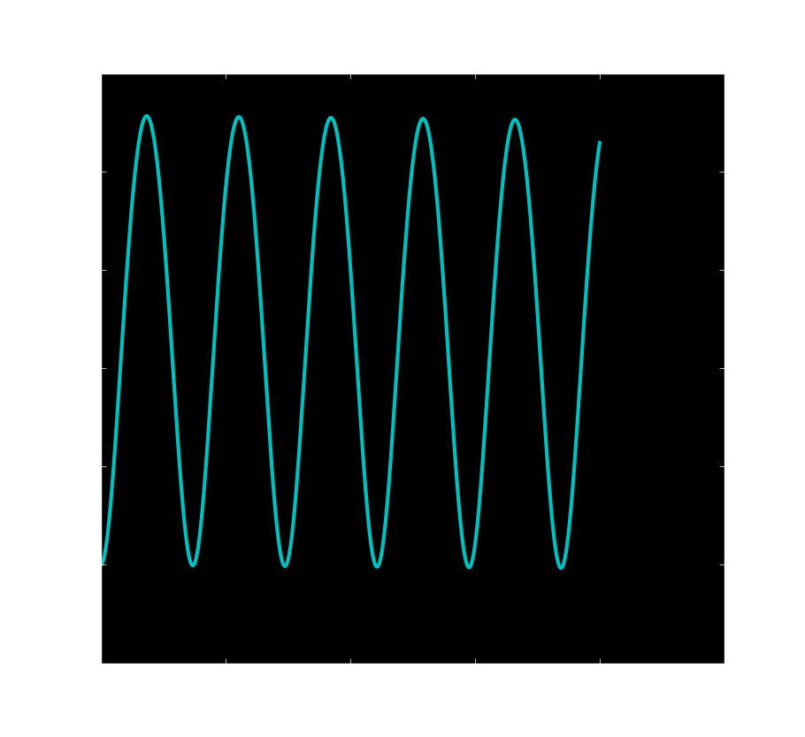

# Chaos in the Driven Nonlinear Pendulum

## Abstract
With **Euler-Cromer Method** and **bisection method**, it is easy to achieve a better solution to the driven nonlinear pendulum problem. And it is of great interest to study the **deterministic chaos**. In this exercise, I construct the Poincaré section and estimate the Lyapunov exponents.

## Background

### Euler-Cromer method
> From [Wikipedia](https://en.wikipedia.org/wiki/Semi-implicit_Euler_method), the free encyclopedia

In mathematics, the semi-implicit Euler method, also called symplectic Euler, semi-explicit Euler, Euler–Cromer, and Newton–Størmer–Verlet (NSV), is a modification of the Euler method for solving Hamilton's equations, a system of ordinary differential equations that arises in classical mechanics. It is a symplectic integrator and hence it yields better results than the standard Euler method.

#### Setting
The semi-implicit Euler method can be applied to a pair of differential equations of the form

where f and g are given functions. Here, x and v may be either scalars or vectors. The equations of motion in Hamiltonian mechanics take this form if the Hamiltonian is of the form

The differential equations are to be solved with the initial condition

#### The method
The semi-implicit Euler method produces an approximate discrete solution by iterating

where Δt is the time step and tn = t0 + nΔt is the time after n steps.

The difference with the standard Euler method is that the semi-implicit Euler method uses vn+1 in the equation for xn+1, while the Euler method uses vn.

Applying the method with negative time step to the computation of {\displaystyle (x_{n},v_{n})} (x_n,v_n) from {\displaystyle (x_{n+1},v_{n+1})} (x_{n+1},v_{n+1}) and rearranging leads to the second variant of the semi-implicit Euler method

which has similar properties.

The semi-implicit Euler is a first-order integrator, just as the standard Euler method. This means that it commits a global error of the order of Δt. However, the semi-implicit Euler method is a symplectic integrator, unlike the standard method. As a consequence, the semi-implicit Euler method almost conserves the energy (when the Hamiltonian is time-independent). Often, the energy increases steadily when the standard Euler method is applied, making it far less accurate.

### Kepler's laws of planetary motion

In astronomy, Kepler's laws of planetary motion are three scientific laws describing the motion of planets around the Sun.
> 1. The orbit of a planet is an ellipse with the Sun at one of the two foci.
> 2. A line segment joining a planet and the Sun sweeps out equal areas during equal intervals of time.
> 3. The square of the orbital period of a planet is proportional to the cube of the semi-major axis of its orbit.

Most planetary orbits are nearly circular, and careful observation and calculation are required in order to establish that they are not perfectly circular. Calculations of the orbit of Mars, whose published values are somewhat suspect, indicated an elliptical orbit. From this, Johannes Kepler inferred that other bodies in the Solar System, including those farther away from the Sun, also have elliptical orbits.

Kepler's work (published between 1609 and 1619) improved the heliocentric theory of Nicolaus Copernicus, explaining how the planets' speeds varied, and using elliptical orbits rather than circular orbits with epicycles.

Isaac Newton showed in 1687 that relationships like Kepler's would apply in the Solar System to a good approximation, as a consequence of his own laws of motion and law of universal gravitation.

Kepler's laws are part of the foundation of modern astronomy and physics.

## Problem Description
Here is **not** the problem in the book(page 65).

> 3.12. In constructing the Poincaré section in Figure 3.9 we plotted points only at times that were in phase with the driven force; that is, at times ...

> 3.13. Write a program to calculate the divergence of two nearby trajectories in the chaotic regime, as in Figure 3.7, and make a qualitive estimate of the corresponding Lyapunov exponent from the slope of a plot ...

> 3.14. Repeat the previous problem, but give the two pendulum slightly different damping factors. How does the value of the Lyapunov exponent compare with the found in Figure 3.7?

What's more, this is just the tip of the iceberg.

## Main
### Problem Analysis
These problem are similar to those in the book. All we need to do is follow its idea and everything is OK. But, we still need to pay to your coding style!

## Results
### Different Orbits with different exponents
Let's have a look at different kinds of orbits under central force field
#### When exponent equals -4

#### When exponent equals -3

#### When exponent equals -2

#### When exponent equals -1

#### When exponent equals 0

#### When exponent equals 1

#### When exponent equals 2

#### When exponent equals 3

We can find that plot patterns change along with different driven force.

Pay attention that -2 is Universal gravitation while 1 is Harmonic oscillator.

### Verify Kepler's law
This is the elliptical orbit we wre going to check.

Radius versus time

Radius versus angle

#### the First Law
We can compare the orbit of the numeriacl result and the real ellipse with the same eccentricity ratio

And the radius pattern

#### the Second Law
Area versus time

#### the Third Law
T^3 versus A^2

## Sad Story
Under the dark theme, the font-color in the screen is white:

But what I have stored are figures with black font-color and you can't see my title and labels:

And I am too lazy to draw them again.

## Discussion
1. Numberical solution makes approximation every step, but in chaos an arbitrarily small change, or perturbation, of the current trajectory may lead to significantly different future behavior. Any other approaches to this problem other than numerical method?
2. If we pick arbitrarily two mechanical quantities of a chaos, the patterns are different. Any better quantity or worse quantity?

## Acknowledgement
1. Thanks to **_John Hunter_**!  
If you have benefited from John's many contributions, please say thanks in the way that would matter most to him. Please consider making a donation to the <a href="http://numfocus.org/johnhunter/">John Hunter Technology Fellowship</a>
2. Thanks to **_Wikipedia_**! I copy too much from you.  
[This year, please consider making a donation of 50, 75, 100 yuan or whatever you can to protect and sustain Wikipedia.](https://donate.wikimedia.org/w/index.php?title=Special:FundraiserLandingPage&country=CN&uselang=en&utm_medium=sidebar&utm_source=donate&utm_campaign=C13_en.wikipedia.org)

