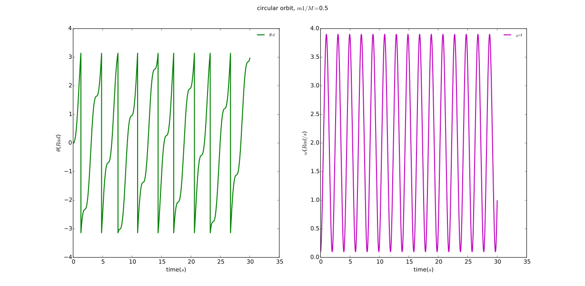

# Chaotic Tumbling of Hyperion

## Abstract
With **Euler-Cromer Method** and **bisection method**, it is easy to achieve a better solution to the *Chaotic Tumbling of Hyperion* problem. And it is of great interest to study the **deterministic chaos**. In this exercise, I construct the Poincaré section and estimate the Lyapunov exponents.

## Background

### Euler-Cromer method
> From [Wikipedia](https://en.wikipedia.org/wiki/Semi-implicit_Euler_method), the free encyclopedia

In mathematics, the semi-implicit Euler method, also called symplectic Euler, semi-explicit Euler, Euler–Cromer, and Newton–Størmer–Verlet (NSV), is a modification of the Euler method for solving Hamilton's equations, a system of ordinary differential equations that arises in classical mechanics. It is a symplectic integrator and hence it yields better results than the standard Euler method.

#### Setting
The semi-implicit Euler method can be applied to a pair of differential equations of the form

where f and g are given functions. Here, x and v may be either scalars or vectors. The equations of motion in Hamiltonian mechanics take this form if the Hamiltonian is of the form

The differential equations are to be solved with the initial condition

#### The method
The semi-implicit Euler method produces an approximate discrete solution by iterating

where Δt is the time step and tn = t0 + nΔt is the time after n steps.

The difference with the standard Euler method is that the semi-implicit Euler method uses vn+1 in the equation for xn+1, while the Euler method uses vn.

Applying the method with negative time step to the computation of {\displaystyle (x_{n},v_{n})} (x_n,v_n) from {\displaystyle (x_{n+1},v_{n+1})} (x_{n+1},v_{n+1}) and rearranging leads to the second variant of the semi-implicit Euler method

![]ihttps://wikimedia.org/api/rest_v1/media/math/render/svg/5345b72f06cf73c459fa753eb60f46b693f1dfbf)

which has similar properties.

The semi-implicit Euler is a first-order integrator, just as the standard Euler method. This means that it commits a global error of the order of Δt. However, the semi-implicit Euler method is a symplectic integrator, unlike the standard method. As a consequence, the semi-implicit Euler method almost conserves the energy (when the Hamiltonian is time-independent). Often, the energy increases steadily when the standard Euler method is applied, making it far less accurate.

### Hyperion
[NASA -- Encountering the Hyperion](https://www.nasa.gov/mission_pages/cassini/multimedia/pia06243.html)

> From Wikipedia, the free encyclopedia

Hyperion (/haɪˈpɪəriən/;Greek: Ὑπερίων), also known as Saturn VII (7), is a moon of Saturn discovered by William Cranch Bond, George Phillips Bond and William Lassell in 1848. It is distinguished by its irregular shape, its chaotic rotation, and its unexplained sponge-like appearance. It was the first non-round moon to be discovered.

#### Physical characteristics

1. Shape   
Hyperion is one of the largest bodies known to be highly irregularly shaped (non-ellipsoidal, i.e. not in hydrostatic equilibrium) in the Solar System.[c] The only larger moon known to be irregular in shape is Neptune's moon Proteus. Hyperion has about 15% of the mass of Mimas, the least massive known ellipsoidal body. The largest crater on Hyperion is approximately 121.57 km (75.54 mi) in diameter and 10.2 km (6.3 mi) deep. A possible explanation for the irregular shape is that Hyperion is a fragment of a larger body that was broken up by a large impact in the distant past. A proto-Hyperion could have been 350–1,000 km (220–620 mi) in diameter. Over about 1,000 years, ejecta from a presumed Hyperion breakup would have impacted Titan at low speeds, building up volatiles in the atmosphere of Titan.
2. Composition   
Like most of Saturn's moons, Hyperion's low density indicates that it is composed largely of water ice with only a small amount of rock. It is thought that Hyperion may be similar to a loosely accreted pile of rubble in its physical composition. However, unlike most of Saturn's moons, Hyperion has a low albedo (0.2–0.3), indicating that it is covered by at least a thin layer of dark material. This may be material from Phoebe (which is much darker) that got past Iapetus. Hyperion is redder than Phoebe and closely matches the color of the dark material on Iapetus.
3. Rotation   
The Voyager 2 images and subsequent ground-based photometry indicated that Hyperion's rotation is chaotic, that is, its axis of rotation wobbles so much that its orientation in space is unpredictable. Its Lyapunov time is around 30 days.[16] Hyperion, together with Pluto's moons Nix and Hydra,[17][18] is among only a few moons in the Solar System known to rotate chaotically, although it is expected to be common in binary asteroids.[19] It is also the only regular planetary natural satellite in the Solar System known not to be tidally locked.

Hyperion is unique among the large moons in that it is very irregularly shaped, has a fairly eccentric orbit, and is near a much larger moon, Titan. These factors combine to restrict the set of conditions under which a stable rotation is possible. The 3:4 orbital resonance between Titan and Hyperion may also make a chaotic rotation more likely. The fact that its rotation is not locked probably accounts for the relative uniformity of Hyperion's surface, in contrast to many of Saturn's other moons, which have contrasting trailing and leading hemispheres.[20]

## Problem Description
Here is **not** the problem in the book(page 65).

> 3.12. In constructing the Poincaré section in Figure 3.9 we plotted points only at times that were in phase with the driven force; that is, at times ...

> 3.13. Write a program to calculate the divergence of two nearby trajectories in the chaotic regime, as in Figure 3.7, and make a qualitive estimate of the corresponding Lyapunov exponent from the slope of a plot ...

> 3.14. Repeat the previous problem, but give the two pendulum slightly different damping factors. How does the value of the Lyapunov exponent compare with the found in Figure 3.7?

What's more, this is just the tip of the iceberg.

## Main
### Problem Analysis
These problem are similar to those in the book. All we need to do is follow its idea and everything is OK. But, we still need to pay to your coding style!

**Polar oordinates** is applied here. 

## Results
### Circular orbit
Results under different ratios of m1 and m2.
#### Theta and omega versus time

#### Omega versus theta 

### Elliptical orbit
Results under different ratios of m1 and m2.

#### Theta and omega versus time

#### Omega versus theta 

#### Lyapunov pattern

## Discussion
1. Numberical solution makes approximation every step, but in chaos an arbitrarily small change, or perturbation, of the current trajectory may lead to significantly different future behavior. Any other approaches to this problem other than numerical method?
2. If we pick arbitrarily two mechanical quantities of a chaos, the patterns are different. Any better quantity or worse quantity?

## Acknowledgement
1. Thanks to **_John Hunter_**!  
If you have benefited from John's many contributions, please say thanks in the way that would matter most to him. Please consider making a donation to the <a href="http://numfocus.org/johnhunter/">John Hunter Technology Fellowship</a>
2. Thanks to **_Wikipedia_**! I copy too much from you.  
[This year, please consider making a donation of 50, 75, 100 yuan or whatever you can to protect and sustain Wikipedia.](https://donate.wikimedia.org/w/index.php?title=Special:FundraiserLandingPage&country=CN&uselang=en&utm_medium=sidebar&utm_source=donate&utm_campaign=C13_en.wikipedia.org)

