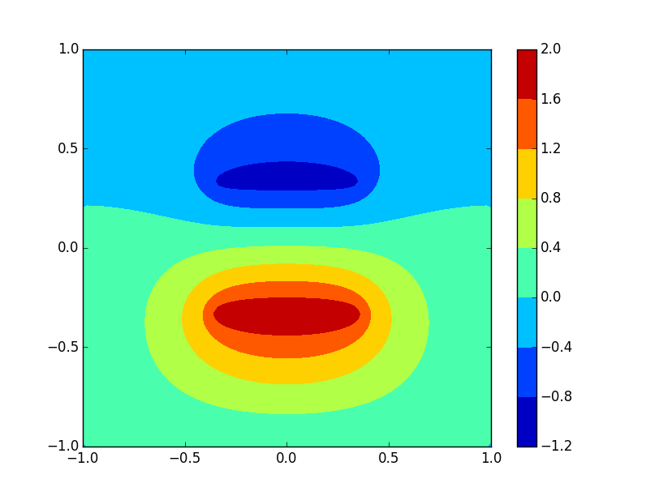

# Solutions to Laplace Function with Relaxation Method

## Abstract
With **Relaxation (iterative method)**, **Gauss–Seidel method**, **Successive over-relaxation** and **Jacobi method**, it is easy to achieve a better solution to the *Laplace function* problem. And it is of great interest to study the **Electrical Field**. In this exercise, I calculate the electrical field.

## Background

### Relaxation (iterative method)
> From [Wikipedia](https://en.wikipedia.org/wiki/Relaxation_(iterative_method)), the free encyclopedia

In numerical mathematics, relaxation methods are iterative methods for solving systems of equations, including nonlinear systems.

Relaxation methods were developed for solving large sparse linear systems, which arose as finite-difference discretizations of differential equations. They are also used for the solution of linear equations for linear least-squares problems and also for systems of linear inequalities, such as those arising in linear programming. They have also been developed for solving nonlinear systems of equations.

Relaxation methods are important especially in the solution of linear systems used to model elliptic partial differential equations, such as Laplace's equation and its generalization, Poisson's equation. These equations describe boundary-value problems, in which the solution-function's values are specified on boundary of a domain; the problem is to compute a solution also on its interior. Relaxation methods are used to solve the linear equations resulting from a discretization of the differential equation, for example by finite differences.

These iterative methods of relaxation should not be confused with "relaxations" in mathematical optimization, which approximate a difficult problem by a simpler problem, whose "relaxed" solution provides information about the solution of the original problem.

### Gauss–Seidel method
In numerical linear algebra, the Gauss–Seidel method, also known as the Liebmann method or the method of successive displacement, is an iterative method used to solve a linear system of equations. It is named after the German mathematicians Carl Friedrich Gauss and Philipp Ludwig von Seidel, and is similar to the Jacobi method. Though it can be applied to any matrix with non-zero elements on the diagonals, convergence is only guaranteed if the matrix is either diagonally dominant, or symmetric and positive definite. It was only mentioned in a private letter from Gauss to his student Gerling in 1823. A publication was not delivered before 1874 by Seidel.

### Successive over-relaxation
In numerical linear algebra, the method of successive over-relaxation (SOR) is a variant of the Gauss–Seidel method for solving a linear system of equations, resulting in faster convergence. A similar method can be used for any slowly converging iterative process.

It was devised simultaneously by David M. Young, Jr. and by Stanley P. Frankel in 1950 for the purpose of automatically solving linear systems on digital computers. Over-relaxation methods had been used before the work of Young and Frankel. An example is the method of Lewis Fry Richardson, and the methods developed by R. V. Southwell. However, these methods were designed for computation by human calculators, and they required some expertise to ensure convergence to the solution which made them inapplicable for programming on digital computers. These aspects are discussed in the thesis of David M. Young, Jr.

### Electric field
An electric field is a vector field that associates to each point in space the Coulomb force that would be experienced per unit of electric charge, by an infinitesimal test charge at that point. Electric fields converge and diverge at electric charges and can be induced by time-varying magnetic fields. The electric field combines with the magnetic field to form the electromagnetic field.


## Problem Description
Here is **not** the problem in the book(page 65).

> 3.12. In constructing the Poincaré section in Figure 3.9 we plotted points only at times that were in phase with the driven force; that is, at times ...

> 3.13. Write a program to calculate the divergence of two nearby trajectories in the chaotic regime, as in Figure 3.7, and make a qualitive estimate of the corresponding Lyapunov exponent from the slope of a plot ...

> 3.14. Repeat the previous problem, but give the two pendulum slightly different damping factors. How does the value of the Lyapunov exponent compare with the found in Figure 3.7?

What's more, this is just the tip of the iceberg.

## Main
### Problem Analysis
These problem are similar to those in the book. All we need to do is follow its idea and everything is OK. But, we still need to pay to your coding style!


## Results
### Different L gives different precision
#### L=12


#### L=30


#### L=60


#### L=90


### Change the boundary condition





#### N versus alpha


## Attention
No one enjoying debugging this kind of error:   
```python
a=[[0]*100]*100
```

## Discussion
1. Numberical solution makes approximation every step, but in chaos an arbitrarily small change, or perturbation, of the current trajectory may lead to significantly different future behavior. Any other approaches to this problem other than numerical method?
2. If we pick arbitrarily two mechanical quantities of a chaos, the patterns are different. Any better quantity or worse quantity?

## Acknowledgement
1. Thanks to **_John Hunter_**!  
If you have benefited from John's many contributions, please say thanks in the way that would matter most to him. Please consider making a donation to the <a href="http://numfocus.org/johnhunter/">John Hunter Technology Fellowship</a>
2. Thanks to **_Wikipedia_**! I copy too much from you.  
[This year, please consider making a donation of 50, 75, 100 yuan or whatever you can to protect and sustain Wikipedia.](https://donate.wikimedia.org/w/index.php?title=Special:FundraiserLandingPage&country=CN&uselang=en&utm_medium=sidebar&utm_source=donate&utm_campaign=C13_en.wikipedia.org)

