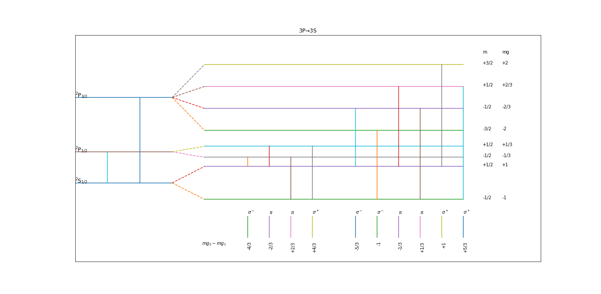

# 绘制反常塞曼效应的原子能级越迁谱线
## 用法
直接输入n1,l1,n2,l2，注意#选择规则#
示例：
```sh
$ python3 spectrum.py 
n of the upper level(1,2,3...): 3
l of the upper level(0,1,2...): 2
n of the lower level(1,2,3...): 3
l of the lower level(0,1,2...): 1
```

## 结果示例
### 3P-->3S

### 3D-->3P

### 4F-->4D

